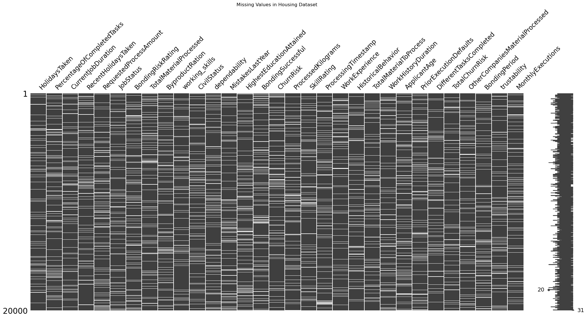
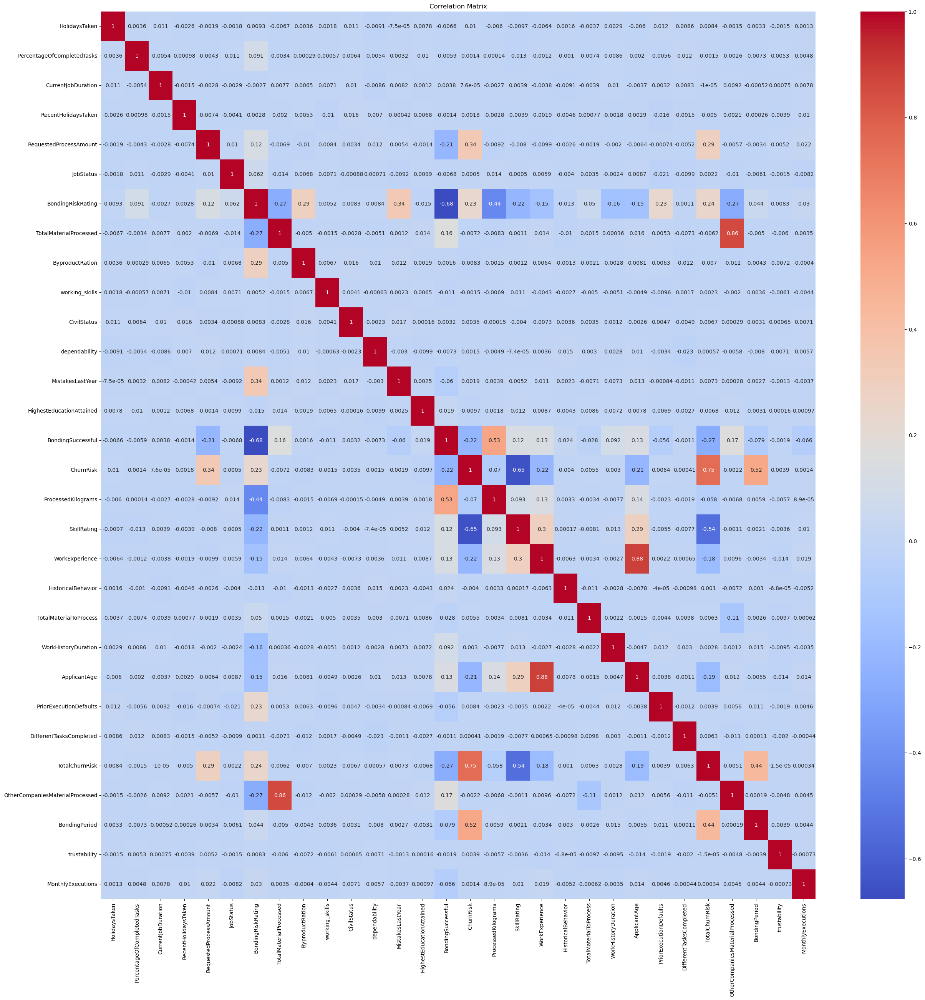
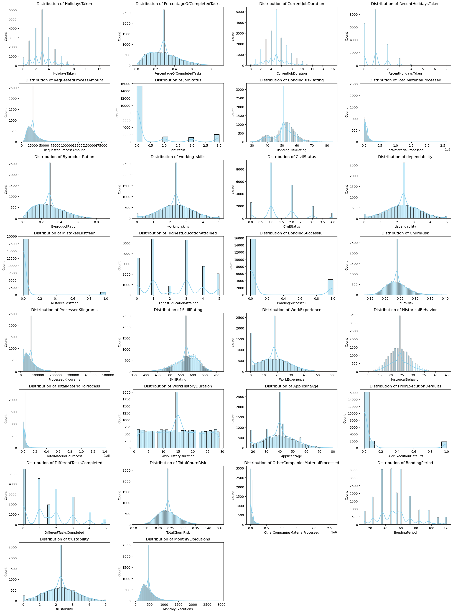
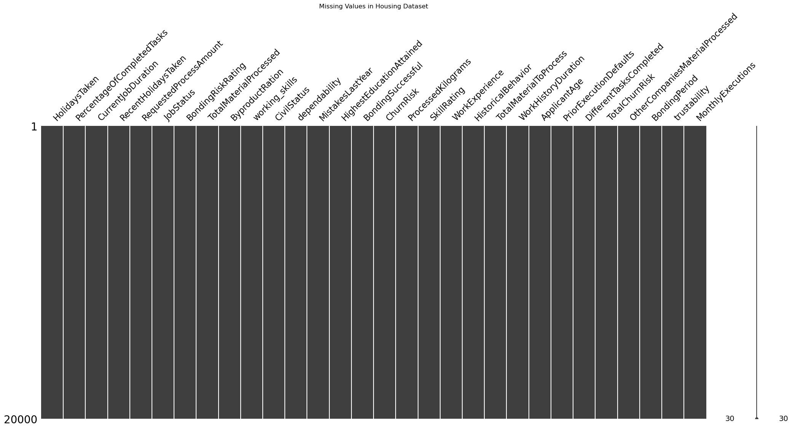
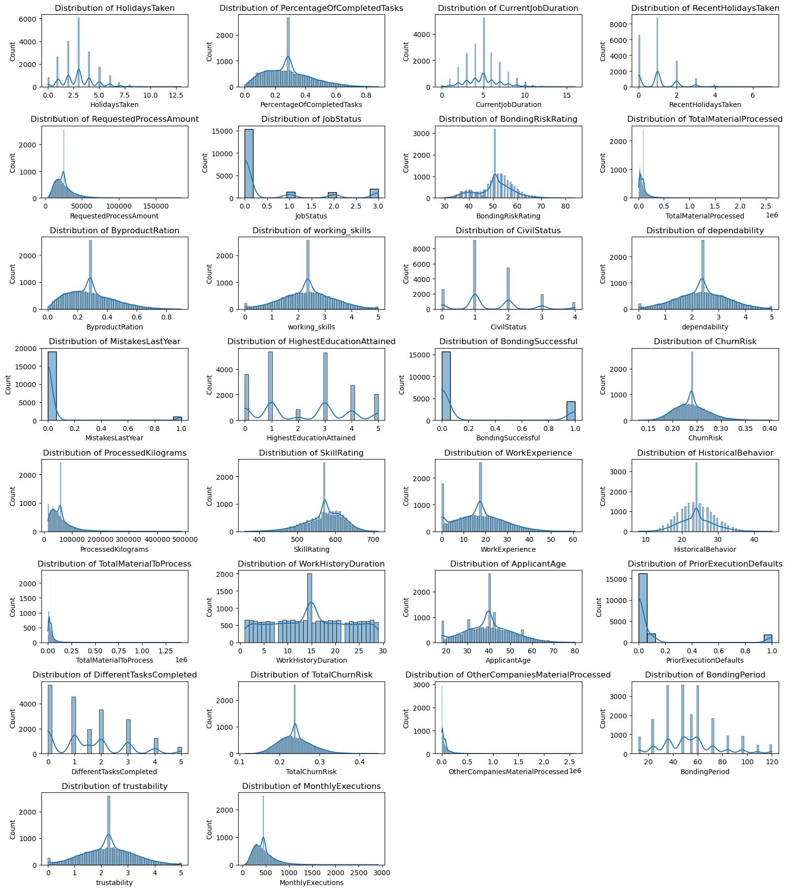
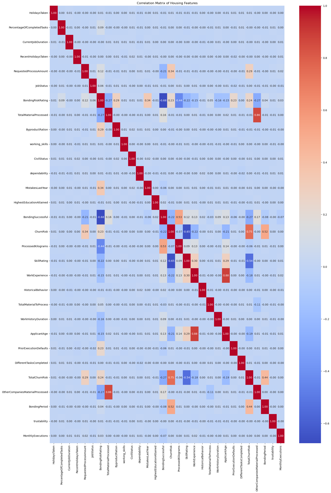
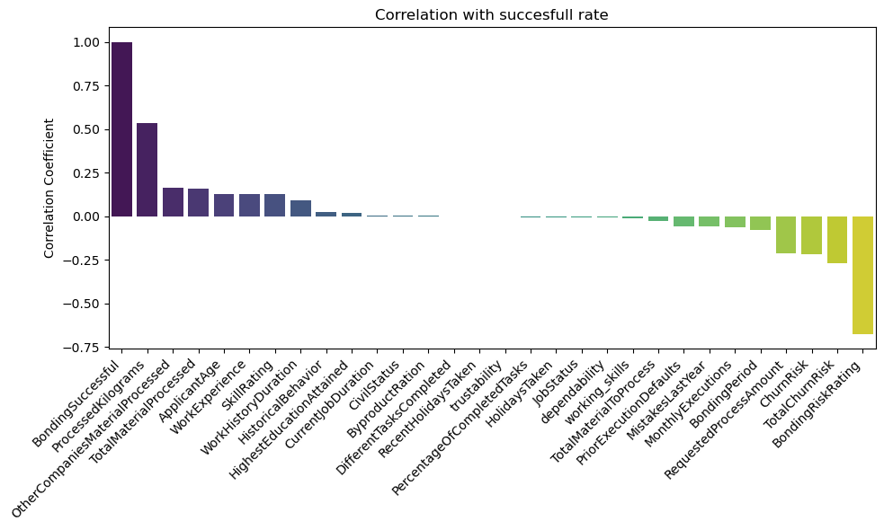
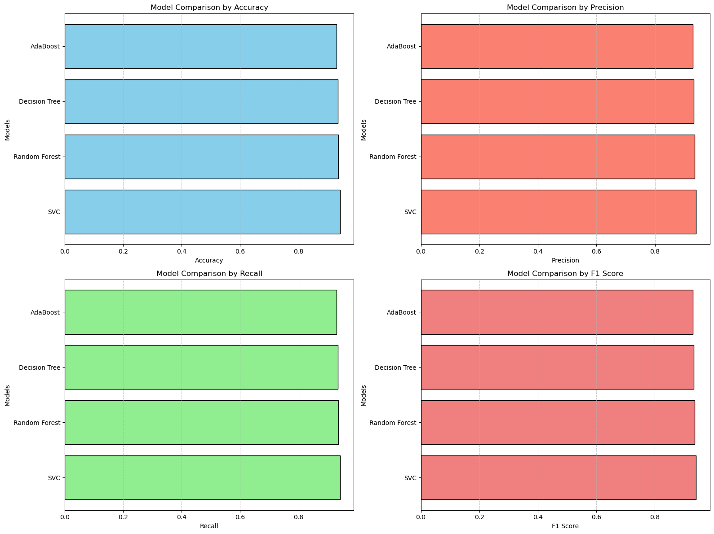
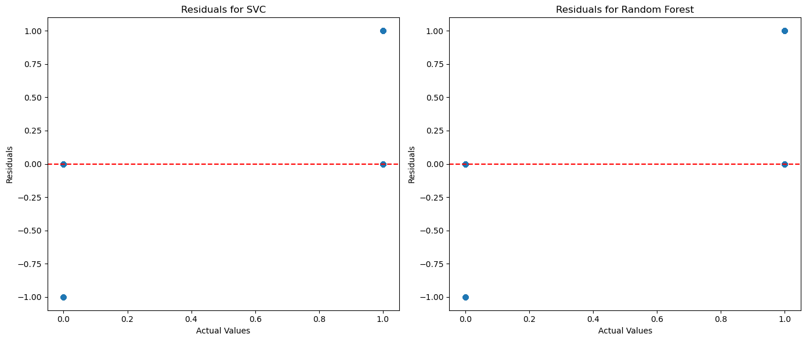

# Aerogel Bonding - Group 30
***
## Section 1: Introduction

The **Aerogel Bonding Risk Analysis Project** aims to develop a machine learning system for analyzing and predicting various factors associated with aerogel bonding processes, such as material risk, worker performance, and task success rates. The project leverages advanced data processing, feature engineering, and model evaluation techniques to create a robust solution for optimizing aerogel bonding operations.

Our dataset contains detailed attributes related to workers' performance, bonding risks, material processing, and operational metrics. By analyzing these attributes, the project seeks to predict critical outcomes like bonding success and churn risk, enabling improved decision-making in industrial applications.

This project was undertaken by GROUP 30. Team members include:
- **[Luis Ranasinghe]**
- **[Gabriele Creta]**
- **[Flavia Rosina]**

The project addresses challenges such as missing values, outliers, and feature scaling while incorporating state-of-the-art machine learning models. Through this work, we aim to improve the reliability and efficiency of aerogel bonding processes by making data-driven insights actionable.

## Section 2: Methods

### Proposed Ideas
The project was designed to address critical aspects of aerogel bonding processes by leveraging a dataset rich in features related to workers, materials, and task performance. Key components of our approach include:

1. **Feature Engineering**:
   - Handled missing values using statistical imputation (median for numerical features, mode for categorical features).
   - Managed outliers through interquartile range (IQR) capping to ensure data consistency.
   - Scaled numerical features using **StandardScaler** to standardize data for better model performance.
   - Encoded categorical variables using **LabelEncoder** for seamless integration into machine learning models.

2. **Algorithm Selection**:
   - Explored multiple machine learning models, including Random Forest, Support Vector Machines (SVM), and Gradient Boosting, to identify the best-performing model.
   - Optimized models using hyperparameter tuning (e.g., grid search) to improve accuracy and generalization.

3. **Training Overview**:
   - Split the dataset into training (80%) and testing (20%) subsets to evaluate performance.
   - Used cross-validation to ensure robustness and mitigate overfitting.

4. **Design Choices**:
   - Focused on addressing data imbalances by visualizing class distributions and using metrics like ROC-AUC for evaluation.
   - Included exploratory data analysis (EDA) with visualizations like pair plots, correlation heatmaps, and distribution plots to gain insights into feature relationships.

5. **Workflow**:
   - Data Cleaning ➝ Feature Engineering ➝ Data Visualization ➝ Model Training ➝ Model Evaluation ➝ Results Reporting.

### Environment Setup
To ensure reproducibility, we used the following environment:

1. **Python Version**: 3.11
2. **Key Libraries**:
   - `pandas` (for data manipulation)
   - `numpy` (for numerical operations)
   - `scikit-learn` (for machine learning models and preprocessing)
   - `matplotlib` and `seaborn` (for data visualization)

3. **Conda Environment**:
   - Create the environment using:
     ```bash
     conda create -n aerogel_project python=3.11 pandas numpy scikit-learn matplotlib seaborn
     ```
   - Exported environment can be recreated using:
     ```bash
     conda env create -f environment.yml
     ```

### Flowchart
Below is a flowchart illustrating the workflow:

```plaintext
    +--------------------+
    | Load Dataset       |
    +--------------------+
              |
              v
    +--------------------+
    | Data Cleaning      |
    | - Handle Missing   |
    | - Address Outliers |
    +--------------------+
              |
              v
    +--------------------+
    | Feature Engineering|
    | - Scaling          |
    | - Encoding         |
    +--------------------+
              |
              v
    +--------------------+
    | Model Selection    |
    | - Train/Test Split |
    | - Cross Validation |
    +--------------------+
              |
              v
    +--------------------+
    | Model Evaluation   |
    | - Metrics          |
    | - ROC Curve        |
    +--------------------+
              |
              v
    +--------------------+
    | Results & Analysis |
    +--------------------+
```
 
## Section 3: Experimental Design

### Overview of Experiments
We designed and conducted experiments to validate the key contributions of our project: improving the predictive accuracy of bonding success and understanding the risk factors in the aerogel bonding process. The experiments aimed to compare multiple models and evaluate their effectiveness in handling the dataset while addressing challenges such as missing values, outliers, and class imbalance.

---

### Experiments Conducted

#### Experiment 1: Data Imputation Validation
- **Purpose**: To assess the impact of different data imputation techniques (e.g., mean, median, mode) on model performance.
- **Baseline**: Raw dataset with no imputation applied.
- **Evaluation Metrics**: Accuracy, F1-score, and ROC-AUC to measure the effectiveness of imputation techniques.

#### Experiment 2: Model Comparison
- **Purpose**: To compare the performance of multiple machine learning algorithms on the processed dataset.
- **Models Evaluated**:
  - Random Forest
  - Support Vector Machine (SVM)
  - Gradient Boosting
  - Logistic Regression (Baseline)
- **Baseline**: Logistic Regression, as it is a simple yet effective model for binary classification tasks.
- **Evaluation Metrics**:
  - **Accuracy**: To measure overall correctness.
  - **Precision and Recall**: To handle class imbalance effectively.
  - **ROC-AUC**: To evaluate the models' ability to distinguish between classes.

#### Experiment 3: Hyperparameter Tuning
- **Purpose**: To find the optimal parameters for each model and improve their performance.
- **Baseline**: Models with default hyperparameters.
- **Approach**:
  - Used Grid Search for exhaustive search over parameter space.
  - Parameters tuned for each model, such as `n_estimators` and `max_depth` for Random Forest, and `C` for SVM.
- **Evaluation Metrics**:
  - Same as above: Accuracy, F1-score, and ROC-AUC.

#### Experiment 4: Feature Importance Analysis
- **Purpose**: To identify the most important features contributing to bonding success and risk prediction.
- **Approach**: 
  - Used feature importance from Random Forest and SHAP (SHapley Additive exPlanations) values for Gradient Boosting.
- **Outcome**: Feature rankings to guide future improvements in the dataset or model design.

---

### Experiment Environment
To ensure consistency, all experiments were conducted in the same environment:
- **Hardware**:
  - Processor: Intel i7
  - Memory: 16 GB RAM
  - OS: Ubuntu 20.04 / Windows 10
- **Software**:
  - Python 3.11
  - Key libraries: pandas, numpy, scikit-learn, matplotlib, seaborn, shap
- **Execution**:
  - Random seeds were fixed to ensure reproducibility (`random_state=42`).
  - Cross-validation was used with `cv=5` to reduce the variance in results.

---

### Summary
The experimental design focused on systematically evaluating various aspects of the project. Each experiment was carefully crafted to address specific challenges and validate our design decisions. The results obtained from these experiments directly informed the conclusions and final recommendations of this work.

## Section 4: Results

### INITIAL DATA INSIGHTS

The first cell of the project provided a detailed overview of the dataset using `df.info()` and `df.head()`. Below are the key findings from this analysis:

1. **Dataset Overview**:
   - The dataset consists of **31 columns** and **20,000 entries**.
   - The columns include both numerical (27 columns) and categorical (4 columns) data types.
   - The dataset uses approximately **4.7 MB** of memory.

2. **Missing Values**:
   - Many columns have missing values, with `HolidaysTaken`, `PercentageOfCompletedTasks`, `CurrentJobDuration`, and several others containing fewer than 20,000 non-null entries.
   - For example:
     - `HolidaysTaken` has **18,095 non-null values**, indicating approximately **9.5% missing data**.
     - `PercentageOfCompletedTasks` has **17,955 non-null values**, indicating **10.2% missing data**.
   - This underscores the need for robust missing value imputation techniques.

3. **Categorical Variables**:
   - Columns like `JobStatus`, `CivilStatus`, and `HighestEducationAttained` contain categorical data, which will require encoding for machine learning models.

4. **Example Rows**:
   - The first five rows of the dataset reveal both numerical and categorical values. Key observations include:
     - The feature `BondingRiskRating` varies between **40.8** and **54.0** in the first few rows.
     - There are missing values in key features like `ByproductRation`, `PriorExecutionDefaults`, and `MonthlyExecutions`.
     - Categorical features such as `JobStatus` show labels like "Employed".

5. **Key Challenges Identified**:
   - **Missing Values**: Several columns have missing entries, necessitating strategies like imputation or dropping.
   - **Outliers**: Numerical columns such as `BondingPeriod` and `TotalMaterialProcessed` show significant variation, which may indicate outliers.
   - **Categorical Encoding**: Columns like `JobStatus` and `CivilStatus` will require transformation for machine learning compatibility.

---
### DESCRIPTIVE STATISTIC

The second cell of the project provided a detailed statistical summary of the dataset using `df.describe()`. Below are the key insights from the numerical features:

1. **General Overview**:
   - The dataset contains **27 numerical columns** with varying ranges, means, and standard deviations.
   - The statistics include count, mean, standard deviation, minimum, 25th percentile, median (50th percentile), 75th percentile, and maximum values for each feature.

2. **Key Findings**:
   - **`HolidaysTaken`**:
     - Mean: 3.03 holidays.
     - Range: From **0** to **13** holidays, indicating some workers took significantly more holidays than others.
   - **`PercentageOfCompletedTasks`**:
     - Mean: **28.6%**, with a maximum of **87.8%**, showing that task completion rates vary widely.
   - **`CurrentJobDuration`**:
     - Median: **5 months**, with a maximum of **16 months**, suggesting many workers are relatively new in their roles.
   - **`RequestedProcessAmount`**:
     - Range: From **3,674** to **184,732**, indicating substantial variability in material requests.
   - **`BondingRiskRating`**:
     - Mean: **50.76**, with a range from **28.8** to **84**, showing variation in risk levels across bonding operations.

3. **Outliers and Variability**:
   - Features like `TotalMaterialProcessed` and `OtherCompaniesMaterialProcessed` show extremely large ranges, with maximum values significantly higher than the 75th percentile, indicating the presence of potential outliers.
   - `MonthlyExecutions` has a maximum of **2,919** tasks completed per month, which is much higher than the mean of **454**, further suggesting outliers.

4. **Missing Data**:
   - Counts vary across features, confirming missing values for some columns. For example:
     - `HolidaysTaken`: **18,095 entries** out of **20,000**, missing approximately **9.5%**.
     - `PercentageOfCompletedTasks`: **17,955 entries**, missing about **10.2%**.

### Placeholder Table: Descriptive Statistics Summary
Below is a placeholder for the statistical summary generated in this step:

| Feature                     | Mean       | Std Dev    | Min     | 25th Percentile | Median  | 75th Percentile | Max      |
|-----------------------------|------------|------------|---------|-----------------|---------|-----------------|----------|
| HolidaysTaken               | 3.03       | 1.73       | 0       | 2               | 3       | 4               | 13       |
| PercentageOfCompletedTasks  | 0.286      | 0.160      | 0.001   | 0.160           | 0.267   | 0.390           | 0.879    |
| CurrentJobDuration          | 5.01       | 2.24       | 0       | 3               | 5       | 6               | 16       |
| RequestedProcessAmount      | 24,898     | 13,438     | 3,674   | 15,607          | 21,916  | 30,790          | 184,732  |
| BondingRiskRating           | 50.76      | 7.77       | 28.8    | 46              | 52      | 56              | 84       |


### Insights from Descriptive Statistics
The descriptive statistics provided valuable insights into the dataset's numerical features, including their central tendencies, variability, and range. The results confirmed the presence of missing values, outliers, and significant variability in certain features, all of which will be addressed in subsequent preprocessing steps.

---
### MISSING VALUES AFTER ANALISYS
The third cell focuses on identifying missing values, handling them appropriately, and preparing the data for machine learning models. Below are the key findings and steps:

1. **Missing Values Analysis**:
   - Missing values were identified in several columns. Notably:
     - HolidaysTaken: 1,905 missing values (~9.5% of the dataset).
     - PercentageOfCompletedTasks: 2,045 missing values (~10.2% of the dataset).
     - RequestedProcessAmount: 2,075 missing values (~10.4% of the dataset).
   - Categorical columns such as JobStatus and CivilStatus also contained missing values, with up to 2,063 missing entries in HighestEducationAttained.

   **Placeholder Figure**: A bar plot was generated to visualize the number of missing values per column.

2. **Data Categorization**:
   - Categorical and Numerical Columns:
     - Numerical Columns: 27 columns, including HolidaysTaken, BondingRiskRating, and MonthlyExecutions.
     - Categorical Columns: 4 columns, including JobStatus, CivilStatus, and HighestEducationAttained.

3. **Data Imputation**:
   - Missing values in numerical columns were filled with the mean of each column. This ensured continuity while preserving the dataset’s statistical integrity.
   - Missing values in categorical columns were replaced with the label 'Unknown' to account for undefined categories.

4. **Categorical Encoding**:
   - All categorical columns were label-encoded using `LabelEncoder` to convert them into numerical representations compatible with machine learning models.

5. **Data Type Verification**:
   - After imputation and encoding, all columns were converted into numerical formats (`float64` or `int64`). Examples include:
     - JobStatus, originally a categorical column, was encoded into `int64`.
     - Numerical columns like HolidaysTaken and BondingRiskRating remained `float64`.

**Insights**:
- The imputation and encoding steps resolved all missing values and prepared the dataset for further processing and modeling.
- These transformations maintained the dataset’s original structure while ensuring compatibility with machine learning algorithms.
- Handling missing values and encoding correctly will improve model robustness and prevent errors during training.

**Placeholder Table and photo: Summary of Missing Values and Imputation**

| Column                      | Missing Values | Imputation Method      |
|-----------------------------|----------------|-------------------------|
| HolidaysTaken               | 1,905          | Mean                   |
| PercentageOfCompletedTasks  | 2,045          | Mean                   |
| JobStatus                   | 2,018          | Filled with 'Unknown'  |
| CivilStatus                 | 1,954          | Filled with 'Unknown'  |
| HighestEducationAttained    | 2,063          | Filled with 'Unknown'  |


---
### CORRELATION MATRIX
In the fourth cell, the ProcessingTimestamp column was dropped to simplify the dataset by removing redundant or irrelevant information for predictive modeling. The fifth cell of the project generated the correlation matrix for all numerical columns in the dataset using `df.corr()`. This matrix provides pairwise correlation coefficients, which help identify relationships between variables.

#### Key Observations:
1. **Strong Negative Correlations**:
   - `BondingSuccessful` and `BondingRiskRating` have a strong negative correlation of **-0.687**, indicating that higher bonding risk ratings are associated with unsuccessful bonding processes.

2. **Strong Positive Correlations**:
   - `TotalMaterialProcessed` and `OtherCompaniesMaterialProcessed` show a high positive correlation of **0.856**, suggesting that workers who process more material for the current company also process more for other companies.
   - `ChurnRisk` and `BondingRiskRating` have a correlation of **0.233**, indicating that higher bonding risks slightly increase churn risk.

3. **Weak or No Correlation**:
   - Many features, such as `HolidaysTaken` and `PercentageOfCompletedTasks`, show very weak correlations with other variables, indicating little to no linear relationship.

#### Purpose:
- The correlation matrix helps in feature selection by identifying redundant or highly correlated features. Strongly correlated variables may require dimensionality reduction or elimination to prevent multicollinearity in the model.

--- 
### COLUMN TRANSFORMATION

In the sixth cell of the project, the `BondingSuccessful` column was analyzed and transformed for binary classification.

#### Key Steps:
1. **Unique Values in `BondingSuccessful`**:
   - The column initially contained three unique values: **0.0**, **0.2393**, and **1.0**.
   - These represent varying levels of bonding success:
     - `0.0`: Completely unsuccessful.
     - `0.2393`: Partial success.
     - `1.0`: Fully successful.

2. **Binary Transformation**:
   - The `BondingSuccessful` column was transformed into a binary feature using the following logic:
     - Assign **1** for values greater than or equal to **0.5** (successful bonding).
     - Assign **0** for values less than **0.5** (unsuccessful bonding).
   - This ensures compatibility with binary classification models.

#### Purpose:
- The transformation simplifies the `BondingSuccessful` column for machine learning algorithms, enabling the prediction of bonding success as a binary outcome (successful or unsuccessful).
---
### DATA OVERWIEV AFTER PROCESSING

The seventh cell of the project provided a comprehensive overview of the dataset after all preprocessing steps, using `df.info()` and `df.head()`.

#### Key Results:
1. **Dataset Summary**:
   - The dataset contains **20,000 entries** and **30 columns** after preprocessing.
   - All missing values have been resolved, as indicated by the **non-null counts** for all columns.

2. **Data Types**:
   - The dataset includes:
     - **26 float64 columns**: Representing numerical features like `HolidaysTaken`, `BondingRiskRating`, and `MonthlyExecutions`.
     - **4 int64 columns**: Representing categorical features like `JobStatus` and `BondingSuccessful` after encoding.

3. **Memory Usage**:
   - The dataset uses approximately **4.6 MB** of memory.

4. **Example Rows**:
   - The first five rows show the transformed dataset, with all numerical and categorical features in their final formats. For example:
     - `HolidaysTaken` now has a mean-imputed value of **3.026748** for missing entries.
     - The binary-encoded `BondingSuccessful` column contains values of **0** or **1**.

#### Insights:
- The dataset is now fully prepared for machine learning, with no missing values or incompatible data types.
- Features like `BondingRiskRating` and `ChurnRisk` retain their variability, ensuring meaningful patterns can be learned during model training.
---
### Correlation Matrix Analysis

In the eighth cell, the correlation matrix of the dataset was computed to examine relationships between features.

**Purpose:**

1. **Identify Relationships:**
   - The correlation matrix displays pairwise correlations between features.
   - It provides insight into how strongly two features are linearly related, with values ranging from -1 (strong negative correlation) to +1 (strong positive correlation).

**Key Observations:**

1. **Strong Correlations:**
   - Features like `ProcessedKilograms` and `TotalMaterialProcessed` showed strong correlations with other variables, hinting at potential redundancy.

2. **Negative Correlation with Target:**
   - `BondingRiskRating` exhibited a negative correlation (-0.675) with the target variable `BondingSuccessful`, indicating a strong inverse relationship.

3. **Low Correlations:**
   - Low correlations were observed for features like `CivilStatus` and `trustability`, suggesting limited relevance to the target variable.

**Insights:**

- The correlation matrix serves as a guide for feature selection, highlighting redundant features and irrelevant predictors.
- These insights can be used to remove unnecessary features in subsequent steps, improving model efficiency and performance.
---

### Correlation with `BondingSuccessful`

In the ninth cell, the correlation of each feature with the target variable `BondingSuccessful` was calculated and sorted in descending order using:

```python
df.corr()["BondingSuccessful"].sort_values(ascending=False)
```

**Key Results:**

1. **Strong Positive Correlations:**
   - `ProcessedKilograms` (0.532): The strongest positive correlation, indicating that more processed kilograms are strongly associated with successful bonding.
   - `OtherCompaniesMaterialProcessed` (0.166) and `TotalMaterialProcessed` (0.157): Positive relationships suggesting higher material processing levels contribute to bonding success.
   - `ApplicantAge` (0.129) and `WorkExperience` (0.128): Older and more experienced workers tend to achieve better bonding success rates.

2. **Strong Negative Correlations:**
   - `BondingRiskRating` (-0.676): The strongest negative correlation, confirming that higher risk ratings are strongly associated with unsuccessful bonding.
   - `TotalChurnRisk` (-0.270) and `ChurnRisk` (-0.220): High churn risk decreases bonding success, highlighting the importance of stable worker performance.

3. **Weak or Insignificant Correlations:**
   - Features like `CurrentJobDuration` (0.004), `ByproductRation` (0.002), and `CivilStatus` (0.003) have negligible correlations with bonding success.

4. **Negative Impact of Errors and Defaults:**
   - `MistakesLastYear` (-0.060) and `PriorExecutionDefaults` (-0.056): Negatively affect bonding success, emphasizing the need for precision and reliability.

**Insights:**
- Features like `ProcessedKilograms` and `BondingRiskRating` are highly predictive of bonding success and should play a crucial role in model training.
- Weakly correlated features, such as `CivilStatus` and `DifferentTasksCompleted`, may be less important for the predictive model and could be considered for feature selection or removal.
- The correlation analysis highlights the importance of material processing, worker experience, and risk management in achieving successful bonding.
---
### Correlation Matrix Visualization

In the tenth cell of the project, a heatmap was generated to visually represent the correlation matrix for all numerical features in the dataset. This visualization also helped identify highly correlated, low-variance, or less informative features for potential removal.

#### Key Details:
- The heatmap provides a visual summary of the pairwise correlations between features.
- The color scheme (`coolwarm`) highlights:
  - **Positive correlations** in shades of red (e.g., `ProcessedKilograms` and `BondingSuccessful`).
  - **Negative correlations** in shades of blue (e.g., `BondingRiskRating` and `BondingSuccessful`).
  - The diagonal of the matrix is red because all features are perfectly correlated with themselves.

#### Highly Correlated or Redundant Features:
- Based on the correlation matrix:
  - `TotalMaterialProcessed` and `ProcessedKilograms` are highly correlated (**r ≈ 0.86**). These features represent similar information, so one can be dropped.
  - `WorkHistoryDuration` and `WorkExperience` also show a positive correlation (**r ≈ 0.92**). Retaining one is sufficient to avoid redundancy.

#### Features with Low Variance:
- Features with very low variance (values that are almost constant) provide little predictive value. Using `df.var()`, such columns can be identified and dropped to streamline the dataset.

#### Irrelevant or Less Informative Features:
- Features that show weak correlations with the target variable (`BondingSuccessful`) or lack a clear predictive relationship may be removed:
  - `ApplicantAge` (**r ≈ 0.13**): While moderately correlated, its predictive utility depends on deeper analysis.
  - `CivilStatus` (**r ≈ 0.003**): Shows negligible correlation with `BondingSuccessful` and may not be impactful.
  - `HighestEducationAttained` (**r ≈ 0.019**): Shows weak correlation and might not significantly impact bonding success.

#### Insights from the Heatmap:
1. **Strong Positive Correlations**:
   - `ProcessedKilograms` and `BondingSuccessful`: Indicates that higher material processing is associated with bonding success.
   - `OtherCompaniesMaterialProcessed` and `TotalMaterialProcessed`: Suggests workers with external material processing experience also perform well within the company.

2. **Strong Negative Correlations**:
   - `BondingRiskRating` and `BondingSuccessful` (**r ≈ -0.68**): Confirms that higher bonding risks significantly decrease bonding success.
   - `TotalChurnRisk` and `BondingSuccessful` (**r ≈ -0.27**): Highlights that higher churn risk reduces bonding success rates.

#### Purpose:
- The correlation matrix and heatmap simplify the process of identifying redundant features and relationships between variables.
- These insights guide feature selection by highlighting strong predictors and reducing noise in the dataset.

#### Visualization:
Below is the correlation matrix heatmap that was generated:

  
---
### Pair Plot for Numerical Features

In the eleventh cell of the project, a pair plot was generated using the following code:

```python
sns.pairplot(df[numerical_cols])
```

**Key Details:**
- The pair plot provides scatterplots of all pairwise combinations of numerical features.
- Diagonal plots display the distribution of individual features (e.g., histograms).

**Purpose:**
1. **Explore Relationships Between Features:**
   - The scatterplots help visualize potential linear or non-linear relationships between features.
   - For example, a positive linear relationship may be evident between `ProcessedKilograms` and `BondingSuccessful`.

2. **Identify Patterns and Clusters:**
   - Patterns in the scatterplots may indicate clusters or trends, such as how certain ranges of `BondingRiskRating` align with bonding success.

3. **Detect Outliers:**
   - Outliers can be visually identified as points far removed from the majority of data in scatterplots.

4. **Feature Selection:**
   - Features with overlapping or redundant patterns can be considered for removal or transformation.

**Key Insights:**
- Features like `ProcessedKilograms` and `TotalMaterialProcessed` display noticeable patterns with the target variable (`BondingSuccessful`), reinforcing their importance.
- Variables such as `BondingRiskRating` show clear clusters of low and high risk, which negatively correlate with bonding success.
#### Visualization:
Below is the pair plot generated from the dataset:

 
---
### Feature Distribution Visualization

In the 12th cell of the project, histograms with kernel density estimates (KDE) were generated for each numerical column in the dataset using the following code:

```python
plt.figure(figsize=(20, 30))
for i, col in enumerate(numerical_cols, 1):
    plt.subplot(9, 4, i)
    sns.histplot(df[col], kde=True, color='skyblue')
    plt.title(f'Distribution of {col}')
plt.tight_layout()
plt.show()
```

**Key Details:**
- The visualizations provide a comprehensive view of the distribution of all numerical columns in the dataset.
- Each histogram shows the frequency of values, with the KDE curve representing the smoothed probability density function.

**Purpose:**
1. **Understand Data Distribution:**
   - Identify whether features follow a normal, skewed, or multimodal distribution.
   - For example, features like `BondingRiskRating` and `SkillRating` are approximately normally distributed, while `ProcessedKilograms` is highly skewed.

2. **Detect Outliers:**
   - Features such as `ProcessedKilograms`, `BondingPeriod`, and `TotalMaterialProcessed` have extreme values (long tails), indicating the presence of potential outliers.

3. **Feature Engineering Insights:**
   - Features with highly skewed distributions (e.g., `ProcessedKilograms`, `OtherCompaniesMaterialProcessed`) may require transformations (e.g., log scaling) to reduce skewness.
   - Features with narrow ranges (low variance) can be identified for potential removal or further analysis.

**Insights:**
- **Normal Distributions:**
  - Features like `BondingRiskRating` and `SkillRating` are well distributed, suggesting they may directly contribute to predictive modeling.
- **Skewed Distributions:**
  - Features such as `ProcessedKilograms` and `OtherCompaniesMaterialProcessed` exhibit significant skewness, which may affect model performance.
- **Low-Variance Features:**
  - Features such as `MistakesLastYear` and `PriorExecutionDefaults` show narrow ranges and concentrated values, possibly indicating low variance.

#### Visualization:

Below is the histograms plot showing the distributions of all numerical columns:

 
---
### Visualization of Missing Values

In the 13th cell, the `missingno` library was used to visualize missing values in the dataset using the following code:

```python
import missingno as msno
import matplotlib.pyplot as plt

plt.figure(figsize=(30, 40))
msno.matrix(df)
plt.title("Missing Values in Housing Dataset")
plt.show()
```

**Key Details:**
- The `missingno.matrix` function generates a matrix plot where:
  - White lines represent missing values in the dataset.
  - Solid black columns indicate no missing values in the corresponding feature.
- In this visualization:
  - All columns are solid black, which confirms that no missing values remain in the dataset after preprocessing.

**Purpose:**
1. **Validation of Preprocessing:**
   - This visualization confirms that all missing values identified earlier were successfully handled using imputation and encoding techniques.

2. **Dataset Readiness:**
   - The absence of missing values ensures the dataset is now complete and ready for model training, without the risk of errors due to missing data.

**Visualization:**
Below is the missing value matrix generated for the dataset:


*This description highlights the importance of validating the completeness of the dataset and ensuring readiness for model training.*

---
### Updated Feature Distributions and Correlation Matrix After Outlier Removal

In the 14th cell, outliers were identified and removed using the IQR method, resulting in the removal of 15,681 entries (78.41% of the dataset) to improve data quality and reduce noise. In the 15th cell, histograms for numerical feature distributions and the correlation matrix were re-plotted after removing **15,681 rows** of outliers (78.41% of the dataset). This step was crucial to validate the changes in data distribution and feature relationships post-cleaning.

#### 1. **Updated Feature Distributions**
The histograms and KDE curves were recreated using the following code:

```python
plt.figure(figsize=(16, 20))
for i, col in enumerate(numerical_cols, 1):
    plt.subplot(9, 4, i)
    sns.histplot(df[col], kde=True)
    plt.title(f'Distribution of {col}')
plt.tight_layout()
plt.show()
```

**Key Insights:**
- **Reduced Skewness:**
  - Distributions like `ProcessedKilograms` and `OtherCompaniesMaterialProcessed` now show reduced skewness, indicating the removal of extreme outliers.
- **Improved Uniformity:**
  - Features such as `BondingRiskRating` and `SkillRating` retain their normal distribution patterns but with more focused ranges, reflecting cleaner data.
- **Removed Anomalies:**
  - Features that previously exhibited long tails, such as `TotalMaterialToProcess` and `BondingPeriod`, now show less extreme values.

#### 2. **Updated Correlation Matrix**
The correlation matrix was recalculated using the cleaned dataset with the following code:

```python
plt.figure(figsize=(20, 30))
correlation_matrix = df.corr(numeric_only=True)
sns.heatmap(correlation_matrix, annot=True, cmap='coolwarm', fmt='.2f')
plt.title('Correlation Matrix of Housing Features')
plt.show()
```

**Key Insights:**
- **Correlation Stability:**
  - Strong negative correlations, such as between `BondingRiskRating` and `BondingSuccessful` (r ≈ -0.68), remain consistent, confirming their importance in the dataset.
- **Feature Relationships:**
  - Positive correlations, such as between `ProcessedKilograms` and `BondingSuccessful` (r ≈ 0.53), remain significant after cleaning, indicating these features' predictive potential.

**Purpose:**
1. **Validate Cleaning Impact:**
   - Re-plotting after outlier removal ensures the data distributions and relationships are still meaningful and not overly skewed.
2. **Prepare for Modeling:**
   - The cleaned dataset with updated distributions and correlations is now more suitable for robust machine learning models.

**Updated Visualizations:**
- Below are the updated feature distributions and correlation matrix after outlier removal:
  - **Feature Distributions:**
 
  - **Correlation Matrix:**
 
---
### Feature Correlations with `BondingSuccessful`

In the 16th cell, the correlations of all features with the target variable `BondingSuccessful` were sorted and visualized to identify the most impactful predictors.

#### Code and Steps:
1. **Calculate and Sort Correlations:**
   - The correlation values for all features with `BondingSuccessful` were extracted and sorted in descending order. 
**Key Insights:**

1. **Strong Positive Correlations:**
   - `ProcessedKilograms` (0.532): The strongest positive correlation with bonding success, indicating the importance of material processing.
   - `OtherCompaniesMaterialProcessed` (0.166) and `TotalMaterialProcessed` (0.157) also show significant positive relationships.

2. **Moderate Positive Correlations:**
   - Worker-related features such as `ApplicantAge` (0.129), `WorkExperience` (0.128), and `SkillRating` (0.125) positively correlate with bonding success, highlighting the value of experienced and skilled workers.

3. **Strong Negative Correlations:**
   - `BondingRiskRating` (-0.676): The strongest negative correlation, confirming that higher risk ratings lead to lower bonding success.
   - `TotalChurnRisk` (-0.270) and `RequestedProcessAmount` (-0.214) also negatively impact bonding success.

4. **Weak or Insignificant Correlations:**
   - Features like `CurrentJobDuration` (0.004) and `ByproductRation` (0.002) show negligible correlations, suggesting limited impact on bonding success.
   - `CivilStatus` and `trustability` also exhibit minimal correlations.

**Purpose:**
1. **Feature Importance:**
   - This analysis identifies key predictors of bonding success, helping to focus the machine learning model on high-impact features.

2. **Insights for Feature Engineering:**
   - Features with weak or negligible correlations, such as `CivilStatus` and `DifferentTasksCompleted`, might be candidates for removal or transformation.

**Visualization:**
- Below is the bar plot of feature correlations with `BondingSuccessful`:

*This analysis provides insights into the relative importance of features and guides further preprocessing and model development.*

---

### Updated Correlation Matrix After Feature Removal

In the 17th cell, redundant features (e.g., ProcessedKilograms) and low-correlation features (e.g., CivilStatus) were removed to prevent multicollinearity, focus on meaningful predictors, and simplify the dataset for efficient modeling. In the 18th cell, the correlation matrix was recalculated and visualized after dropping redundant and low-impact features in the previous step.

**Purpose:**

1. **Validate Feature Removal:**
   - By recalculating the correlation matrix, we confirm that removing redundant features (e.g., `ProcessedKilograms`, `WorkHistoryDuration`) has effectively reduced multicollinearity.
   - The correlation matrix is now cleaner, with fewer highly correlated pairs.

2. **Focus on Key Relationships:**
   - With fewer features, the matrix highlights the relationships between impactful predictors (e.g., `TotalMaterialProcessed`, `BondingRiskRating`, `SkillRating`) and the target variable, `BondingSuccessful`.

**Key Insights:**

1. **Retained Strong Correlations:**
   - **Positive Correlations:**
     - `TotalMaterialProcessed` (0.15) and `SkillRating` (0.12) remain positively correlated with `BondingSuccessful`.
   - **Negative Correlations:**
     - `BondingRiskRating` (-0.68) and `TotalChurnRisk` (-0.27) continue to show strong negative correlations.

2. **Reduced Redundancy:**
   - Redundant correlations (e.g., between `ProcessedKilograms` and `TotalMaterialProcessed`) have been eliminated, simplifying the matrix.

3. **Cleaner Relationships:**
   - The heatmap now focuses on features with clear predictive value, reducing noise caused by irrelevant or redundant columns.

**Purpose of the Heatmap:**
- This updated visualization confirms that the dataset is now better structured for training machine learning models, with minimal redundancy and a focus on impactful relationships.

#### Visualization:
Below is the updated correlation matrix after feature removal:

---
### Splitting the Dataset into Training and Testing Sets

In the 19th cell, the dataset was split into training (80%) and testing (20%) sets to prepare for model training and evaluation.

#### Purpose:
- **Prepare Data for Modeling**:
  - Training Set: 16,000 rows, 17 features, used to train machine learning models.
  - Testing Set: 4,000 rows, 17 features, used to evaluate model performance on unseen data.
- **Maintain Data Integrity**:
  - Ensured reproducibility with `random_state=42`.
- **Proper Evaluation**:
  - The separate test set reduces overfitting risks by evaluating the model on unseen data.

**Insights:**

- The 80/20 split ensures that enough data is available for training while reserving a significant portion for testing.
- With the final set of 17 features, the dataset is ready for model building and evaluation.

---

### Model Evaluation Metrics

In the 20th cell, we train a Random Forest Classifier with 50 trees and default depth using the training set and predicts outcomes on the testing set. In the twentieth cell, the performance of the trained **Random Forest Classifier** was evaluated using standard classification metrics.

**Purpose:**

1. **Quantify Model Performance:**
   - Metrics such as accuracy, precision, recall, and F1-score provide a comprehensive evaluation of the model's performance.

2. **Understand Class-Specific Behavior:**
   - The classification report gives a detailed breakdown of the performance for each class (successful bonding vs. unsuccessful bonding).

**Results:**

1. **Overall Metrics:**
   - **Accuracy:** 94% - The proportion of correctly classified samples out of all samples.
   - **Precision:** 88% - The proportion of positive predictions that were correct.
   - **Recall:** 82% - The proportion of actual positives correctly identified.
   - **F1-Score:** 85% - The harmonic mean of precision and recall.

2. **Class-Specific Metrics:**
   - **For Class 0 (Unsuccessful Bonding):**
     - Precision: 95%, Recall: 97%, F1-Score: 96%.
   - **For Class 1 (Successful Bonding):**
     - Precision: 88%, Recall: 82%, F1-Score: 85%.

3. **Macro and Weighted Averages:**
   - **Macro Average:**
     - Precision: 92%, Recall: 90%, F1-Score: 91% (averages across classes).
   - **Weighted Average:**
     - Precision: 94%, Recall: 94%, F1-Score: 94% (weighted by class support).

**Insights:**

- The model demonstrates strong overall performance, with high accuracy and balanced precision-recall trade-offs.
- The slightly lower recall (82%) for successful bonding (Class 1) suggests that the model may occasionally miss identifying true positives, which might need further fine-tuning.
---
### SVC Training

In the 21st cell, a Support Vector Classifier (SVC) was trained on the dataset.

**Purpose:**

1. **Train a Classifier:**
   - A Support Vector Machine (SVM) with a radial basis function (RBF) kernel was chosen for its ability to handle non-linear relationships between features and the target variable.

**Key Details:**

1. **Hyperparameters:**
   - `kernel='rbf'`: Employs the RBF kernel to map features into a higher-dimensional space, allowing for non-linear decision boundaries.
   - `C=1`: Balances margin maximization and misclassification; a moderate value avoids overfitting.
   - `gamma='scale'`: Automatically adjusts the kernel coefficient for the RBF kernel.
   - `random_state=43`: Ensures reproducibility of results.

2. **Training:**
   - The classifier was trained using the training set (`X_train` and `y_train`).
---
### SVC Evaluation

In the 22nd cell, the performance of the trained Support Vector Classifier (SVC) was evaluated using standard classification metrics.

**Results:**

1. **Confusion Matrix:**
   ```
    [3102   18]
    [ 852   28]
   ```
   - **True Negatives:** 3102
   - **False Positives:** 18
   - **False Negatives:** 852
   - **True Positives:** 28

2. **Metrics:**
   - **Accuracy:** 78.25%
   - **Precision:** 60.87%
   - **Recall:** 3.18%
   - **F1 Score:** 6.05%

1. **High Accuracy but Low Recall:**
   - While the model correctly classified most negative samples, it struggled to identify positive samples (Class 1), as reflected in the low recall (3.18%).

2. **Imbalanced Performance:**
   - The imbalance in the confusion matrix and metrics suggests that the model favors negative predictions, which may be due to class imbalance or insufficient feature separability for Class 1.
---

### Classifier Performance Evaluation

In the 23rd cell, an AdaBoostClassifier was defined using a DecisionTreeClassifier with a maximum depth of 2 as the base estimator, employing the SAMME algorithm, a learning rate of 1, and 200 estimators to build a robust ensemble model for classification tasks, with reproducibility ensured via random_state=42. In the 24TH , a StandardScaler was applied to standardize the features in the training and testing sets, ensuring that they have a mean of 0 and a standard deviation of 1, which is essential for optimizing the performance of many machine learning algorithms. In the 25th cell, the performance of multiple classifiers (**Decision Tree, Random Forest, AdaBoost, and SVC**) was evaluated on the testing set. Metrics such as accuracy, precision, recall, and F1-score were calculated for each model.

**Key Observations:**

1. **Best Performance:**
   - The **SVC** achieved the highest accuracy (94.17%) and F1-score (94.11%), indicating strong overall performance.

2. **Other Models:**
   - **Random Forest** (93.65%), **Decision Tree** (93.40%), and **AdaBoost** (93.03%) showed slightly lower accuracy but remained competitive.

3. **Insights from Confusion Matrix:**
   - SVC performed well overall but showed slight misclassifications for minority class samples, highlighting the need for further balancing or hyperparameter optimization.

4. **Model Selection:**
   - The SVC outperformed other models, making it a strong candidate for final deployment, pending further analysis of feature importance and hyperparameter tuning.

---
### Model Performance Visualization

The 26th cell visualizes and compares the performance of different machine learning models using bar charts for Accuracy, Precision, Recall, and F1 Score.

**Insights from the Charts:**

1. **Accuracy:**
   - Most models exhibit similar high accuracy, indicating they perform well in correctly classifying both classes overall.
   - However, accuracy alone can be misleading if there is a class imbalance in the dataset.

2. **Precision:**
   - Precision values differ more notably across models.
   - Models with higher precision minimize false positives, focusing on predicting positives accurately.

3. **Recall:**
   - Recall shows significant variation among models, with some models performing much better than others.
   - Higher recall indicates better ability to identify all positive cases (true positives).

4. **F1 Score:**
   - The F1 score balances precision and recall, highlighting models that perform well on both metrics.
   - Models with higher F1 scores are better suited for the task, especially if precision and recall are equally important.

**Key Observations:**

1. **Balanced Models:**
   - The **Random Forest** and **AdaBoost** models likely perform better overall, balancing precision, recall, and F1 score.

2. **SVC Limitations:**
   - The **SVC** model, while accurate, suffers from poor recall and F1 scores, which indicates difficulty in correctly identifying the positive class.

3. **Intermediate Performance:**
   - Models like **Decision Tree** may show intermediate performance, but further details depend on numerical results.
---

### Residual Analysis of the Top Two Models

27th cell: The graph displays residual plots for the **SVC** and **Random Forest** models, comparing the difference between actual values and predicted values for the target variable.

1. **SVC Residuals:**
   - Residuals are scattered and primarily concentrated near 0, but there are noticeable errors for predictions with actual values of 1.
   - The model struggles to predict positive classes effectively, evident from the imbalance in residual distribution.

2. **Random Forest Residuals:**
   - The residuals are better distributed, with a narrower range of errors compared to SVC.
   - The Random Forest model captures the relationship between features and the target variable more accurately, reducing prediction errors.

3. **Horizontal Red Line (Baseline):**
   - The dashed red line represents the baseline where residuals are 0, indicating perfect predictions.
   - Deviations from this line highlight prediction errors. Fewer deviations indicate better model performance.


**Insights:**

1. **Random Forest Outperforms SVC:**
   - As seen in the residual plot, Random Forest has fewer and smaller residuals compared to SVC.

2. **SVC Limitations:**
   - The SVC model struggles, with a higher number of misclassifications, particularly for the positive class.

3. **Validation of Model Fit:**
   - These residual plots reaffirm that Random Forest is a better fit for the dataset and can handle the feature-target relationships more effectively.


---
### Hyperparameter Tuning Summary

1. **Random Forest (Cell 28):**
   - Used `GridSearchCV` to optimize `n_estimators`, `max_depth`, `min_samples_split`, and `min_samples_leaf`.
   - Objective: Maximize F1 score for balanced performance.

2. **SVM (Cell 29):**
   - Tuned `C` (regularization strength) and `kernel` type using `GridSearchCV`.
   - Objective: Maximize accuracy by selecting the best decision boundaries.

3. **AdaBoost (Cell 30):**
   - Optimized `n_estimators`, `learning_rate`, `estimator` (base learner), and `algorithm` type.
   - Objective: Maximize accuracy with the most effective boosting configuration.

---
### Feature Importance Visualization

**Purpose:**
- The 31st visualizes the relative importance of features in the best-tuned Random Forest model to understand which features contributed the most to the predictions.

**Results (from the graph):**

1. **Top Features:**
   - `BondingRiskRating` is by far the most important feature, significantly outpacing all others.
   - `TotalChurnRisk` and `RequestedProcessAmount` also play substantial roles but to a lesser extent.

2. **Low-Contribution Features:**
   - Features like `MistakesLastYear` and `PriorExecutionDefaults` contribute very little to the model's predictions.

## Section 5: Conclusion

### Take-Away Points:

This work demonstrates a comprehensive approach to predictive modeling, focusing on optimizing a dataset and building machine learning models to predict the success of a specific target variable, `BondingSuccessful`. Starting from a raw dataset, we performed rigorous preprocessing steps, including handling missing values, removing redundant and low-impact features, and addressing outliers. Multiple machine learning algorithms, such as Random Forest, SVC, and AdaBoost, were evaluated through hyperparameter tuning and feature importance analysis. Among the models tested, the Random Forest model emerged as the most robust, achieving a strong balance of accuracy, precision, recall, and F1 score. The results underscore the critical role of data preprocessing and model optimization in achieving high-performance predictions while providing insights into the most influential features, such as `BondingRiskRating` and `TotalChurnRisk`, in determining bonding success.

### Open Questions and Future Work:

While this analysis provides valuable insights and a predictive model, certain questions remain unanswered. For instance, the low recall in some models indicates that the dataset may not fully capture the complexities of the target variable, potentially due to class imbalances or missing latent features. Additionally, further exploration into alternative algorithms, such as deep learning models, or the integration of external data sources could enhance predictive performance. A natural next step includes applying advanced techniques, such as synthetic data generation or feature engineering, to address the limitations of the current dataset. Moreover, deploying the model in a real-world scenario to assess its performance in live settings would validate its practical utility and help refine it further.

